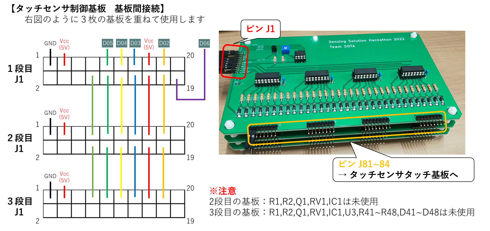

 # 作品について　　

らくラクギターは誰でもかっこよく簡単に弾けるをコンセプトに開発されたギターである。　
　

マイコンはSONY製のSPRESENSEを使用している。　　

このらくラクギターには3種類のモードがある。　　

* ビギナーモード　ホイールを回すだけで演奏できるモード　　
* コードモード　弦を模したタッチセンサを1箇所もしくは2箇所押さえるだけで演奏できるモード　　
* マニュアルモード　本物のギターと同様に演奏できるモード　　

らくラクギターはM,m,7,sus4,dim,aug,M7,m7,7sus4に対応している。　　

らくラクギターの製作から実際に動かすまでの手順を以下に示す。　

1.　必要な部品の準備　　

2.　ギターのハード作成　　

3.　回路の作成　　

4.　動かすための準備　　

5.　らくラクギターの動かし方　

　
以下ではこれらを詳細に述べる。　　

 # 製作&動作手順　　
 ## 必要な部品の準備　　
下記の部品表の通りに各種部品を用意する。

　　

## ギターのハード作成　　
こちらの動画を参考にギターを組み立てる。[youtubeへ移動](https://www.youtube.com/watch?v=TPaNkqSTSBw)　　
　　

表面の板を部品表にもあるベニヤ板で代替した。　　

タッチセンサやグランド線を通すためのスペースはギターのネックをノミや彫刻刀で彫る。　　

また、設計図を基に固定を行う。　　

 ## 回路の作成　　
下記の回路図の通りに部品をはんだづけし、回路を作成する。

※下のタッチセンサ制御基板の配線の図も見てください。

　

基板は[Elecrow](https://www.elecrow.com/)にてオーダメイドで発注したものである。

タッチセンサ制御部の基板データがPCB_data/touch_sensor_main、指版部の基板データがPCB_data/touch_sensor_touchとなっている。　　

 ## 動かすための準備　　
まずはSPRESENSEにプログラムを書き込む。  

SPRESENSEのセットアップを行う。詳しくは[こちら](https://developer.sony.com/develop/SPRESENSE/docs/arduino_set_up_ja.html)

書き込みはArduino IDEを用いる。ビルドも書き込みもメインコアからサブコア3まで1つづつしなければいけないので注意が必要である。メインコアへの書き込みはメモリを640KByteとすること。

次にSDカードに音源データを取り込む。SDカードにAとEのファイルを入れる。そしてSPRESENSEに差し込む。

回路やSPRESENSEの配線を完了させる。

SPRESENSEの配線とタッチセンサ制御基板の配線は以下の図の通りである。

そして設計図を基に裏板を固定する。　　

 ## らくラクギターの動かし方　　
まずは電源供給が必要である。　　

ギターからUSB(TypeA)が出ているのでモバイルバッテリーに接続する。

　
そしてらくラクギターにはスイッチが3つついており、モードを選択できる。

上から1つ目のスイッチを下、3つ目のスイッチを下にするとビギナーモードとなる。　　

上から1つ目のスイッチを下、3つ目のスイッチを上にするとコードモードとなる。

上から1つ目のスイッチを上にするとマニュアルモードとなる。　　

2つ目のスイッチを下にするとアコースティックギター、上にするとエレキギターの音が出せるようになる。　　

ギター裏についているボリュームを回すことで音量調整が可能である。(時計回りで音量が大きく、反時計回りで音量が小さくなる)　　

以下で各モードについて詳細に説明する。　　

共通事項として電源投入から一定時間経つとギターのジャーンと弾く音が勝手に再生される。これは準備完了の合図である。この合図があるまでホイールを回したり、タッチセンサを触ってはいけない。　　

ホイールの回転方向によってアップストロークとダウンストロークの切り替えが可能である。　　

 ### ビギナーモード　　
らくラクギターにPCから楽曲をとりこむ方法から説明する。　　

1. 楽曲を決定し、コード譜をテキストファイル(〇〇.txt)で作成する。　　
2. SPRESENSEに電源を投入する。
3. 楽曲を取り込む用のアプリケーション(rakuraku_guitar_gui.exe)を起動する。
4. 1にて作成したテキストファイルを選択する。　　
5. ジャーンという音がするまで待機し、音がなったらホイールを回すことでビギナーモードの演奏ができる。　　

注意点としては各コードは1ストローク分しか再生されない。なので、コードの変化するタイミングでホイールを回す必要がある。ただし、テキストファイルにコードを2回ずつ打つことで2ストロークづつにするなどテキストファイルの工夫である程度対応することは可能である。

ビギナーモードスイッチをOFFからONにするとコード譜の始めに戻る。　　

また、らくラクギターはコード(音)の変化にしか対応していないため,
タイミングについてはユーザーに完全に委ねられる。

 ### コードモード　　
1. SPRESENSEに電源を投入する。　　
2. ジャーンという音がするまで待機し、音がなったらコードモードの演奏ができる。タッチセンサを触りながらホイールを回すことで触っているセンサの位置に対応しているコードを鳴らすことができる。　　

コードの配置を以下に示す。

1フレット目はCに、12フレット目はBに対応している。

M7はMと7の同時押し、m7はmと7の同時押し、7sus4はsus4と7に同時押しで演奏ができる。　　

どこも触れないままホイールを回すと6弦全てを開放したときの音が鳴る。　　

注意点としてはタッチセンサを触れるときに同時にネック裏に通してあるグランド線も触らないといけない。そうしないとタッチセンサの値が正しく得られずコードがうまく鳴らせない。　　

また、コードの判定は、触れていると判定されているタッチセンサと完全一致することでコードが決定する。逆に言えば他の余計な部分を触っていると正しくコードが認識されない。コードのリストに該当しない押さえ方でホイールを回した場合は無音となる。　　

 ### マニュアルモード　　
1. SPRESENSEに電源を投入する。　　
2. ジャーンという音がするまで待機し、音がなったらマニュアルモードの演奏ができる。タッチセンサを触りながらホイールを回すことで触っているセンサの位置に対応しているコードを鳴らすことができる。　　

マニュアルモードの押さえ方はローコード1種+ハイコード1種、ローコードが存在しない場合はハイコード2種を搭載している。　　

具体的な押さえ方は[ギタコン](https://guitar-concierge.com/chord/)の各コードの見出しになっているコード2種を実装している。ローコードがあるのにも関わらず見出しにローコードが無いコードについてはローコード1種+見出しのハイコード2種の計3種を実装している。　　

どこも触れないままホイールを回すと6弦全てを開放したときの音が鳴る。　　

注意点としてはコードモード同様、タッチセンサを触れるときに同時にネック裏に通してあるグランド線も触らないといけない。そうしないとタッチセンサの値が正しく得られずコードがうまく鳴らせない。　　

また、コードの判定は、触れていると判定されているタッチセンサと完全一致することでコードが決定する。逆に言えば他の余計な部分を触っていると正しくコードが認識されない。コードのリストに該当しない押さえ方でホイールを回した場合は無音となる。　　

開放弦とミュートについては触れないように設定してある。特にミュートの弦に触れないように注意が必要である。

# リポジトリの構成　　

* program：SPRESENSEに書き込むプログラム

* library：SPRESENSEに必要なライブラリの追加データ。詳細は中のreadmeを参照

* rakuraku_guitar_gui：PCで使う楽曲を取り込む用のアプリケーションとそのプログラム

* PCB_data：自作した基板のデータ